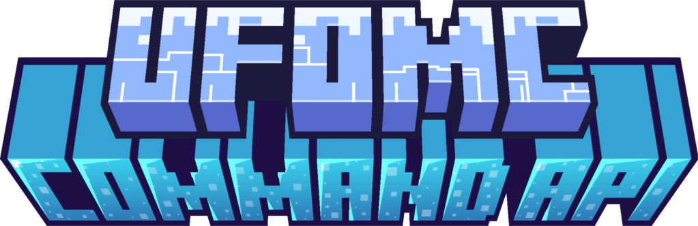
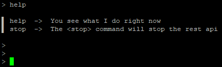

 

What is the UfoMc Console API?
-
> The UfoMc command API is a simple way to add commands to your console.
 - there are 2 preset commands witch are `help -> shows every command and their info`, `stop -> stops the current running jar`
 - you can easyly add your own commands by following the tutorial down below

How does it work?
- 
 - IMPORTANT: `You HAVE to change the path of the package beeing scanned in the **Commands.java** file`

 1. you create a new java class (name it how the commands name should be in uppercase first letter)
  - example: `Help`
 2. you extend the CommandImp.java file
 3. you implement the methodes
 4. you type the discription into the super
 5. you add your code into the execute methode

 > Your command is now registered and you can start the application.
 > The command and its usage will automaticly show up in the help menue.

Example
- 
 

```java
package de.matga.command.commands;

import de.matga.command.imp.CommandImp;

public class Stop extends CommandImp {
    public Stop() {
        super("The <stop> command will stop the rest api");
    }

    @Override
    protected void execute(String[] args) {
        System.exit(0);
    }
}
 ```

Wye should I use console commands?
-
 - console commands are an easy way to manage your application during the uptime
 - also with my simple to use api it is very easy to add new commands without worrying about conding one your self

> So as eazy as that we got our selfs own console commands.
> cool! :D

Any questions left?
- 
 > add me on dc <ufo.dev>.

Credit
-
 - as always: The code is free to use, if you give me a credit or not is your choise.
 - Please do not use it for commercial purpose!
 